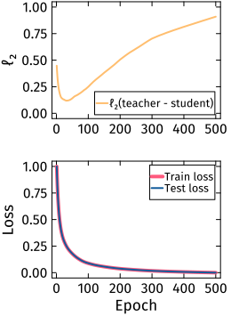
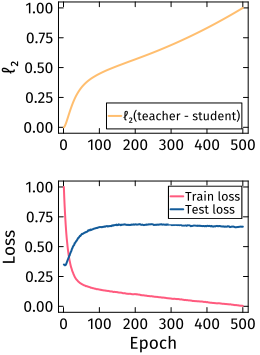
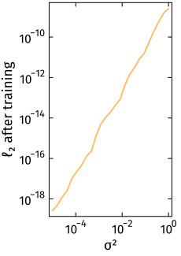

# ℓ₂-Experiments  

This repository contains code for investigating the _ℓ₂-distance rebound phenomenon_ in neural network training, where student networks initially approach but then progressively diverge from teacher network parameters during training, even while improving functionally.  


## Overview  

The experiments explore parameter recovery in teacher-student setups using Fefferman-Markel network architectures with `tanh` activation functions.  
Despite theoretical guarantees suggesting networks should only differ by known symmetry operations, we observe systematic parameter divergence that challenges assumptions about functional-parameter coupling in neural networks.  

## Key Findings  

Our experiments reveal three phenomena:  

- __A: Perturbation Recovery__ - Student initialized with small parameter perturbations
- __B: Noisy Dataset Learning__ - Student initialized exactly as teacher, trained on noisy data  
- __C: Noise Sensitivity Analysis__ - Relationship between noise level and parameter divergence

| Experiment A | Experiment B | Experiment C |
|--------------|--------------|---------------|
|  |  |  |

## Experimental Setup  

### Core Experiments  

The repository supports the following experiments:  

#### Experiment A: Perturbation Recovery (`l2_vs_epoch.jl`)
- __Goal__: Test recovery from small parameter perturbations.  
- __Setup__: `initial_permut > 0`, `noise_σ = 0`.  
- __Student initialization__: Teacher parameters + small random perturbation.  
- __Training data__: Clean, noise-free dataset generated by teacher.  

#### Experiment B: Noisy Dataset Learning (`l2_vs_epoch.jl`)
- __Goal__: Study parameter drift under data uncertainty.  
- __Setup__: `initial_permut = 0`, `noise_σ > 0`.  
- __Student initialization__: Exact copy of teacher parameters.  
- __Training data__: Teacher-generated dataset with Gaussian noise.  

#### Experiment C: Noise Sensitivity Analysis (`l2_vs_noise_level.jl`)
- __Goal__: Quantify relationship between dataset noise level and final parameter divergence.  
- __Setup__: Multiple runs with varying `noise_σ`.  
- __Student initialization__: Exact copy of teacher parameters.  
- __Training data__: Teacher-generated dataset with Gaussian noise.  

## Parameter Configuration  

### Core Training Parameters  

| Parameter               | Default Value      | Description |
|-------------------------|--------------------|-------------|
| `learning_rate`         | `1e-2`             | Gradient descent step size |
| `noise_σ`               | `1e-3`             | Standard deviation of Gaussian noise added to training data |
| `initial_permut`        | `0.0`              | Perturbation strength for student initialization |
| `seed`                  | `42`               | Random seed for reproducibility |
| `epochs`                | `500`              | Number of training iterations |
| `num_runs`              | `10`               | Independent runs for statistical averaging |
| `dataset_size`          | `10000`            | Training dataset size |
| `test_set_size`         | `1000`             | Test dataset size |
| `projection_frequency`  | `1`                | Projection onto manifold ℱ frequency |
| `teacher_dimensions`    | `[2, 25, 25, 1]`   | Network architecture `[input, hidden, hidden, output]` |
| `train_function!`       | `vanilla_train!`   | Training algorithm: `vanilla_train!`, `l1_train!`, or `DRR_train!` |


### Training Algorithm Options

The experiments support multiple training algorithms via the `train_function!` parameter:

| Training Function | Description | Key Parameters |
|-------------------|-------------|----------------|
| `vanilla_train!` | Standard gradient descent | None |
| `l1_train!` | L1-regularized training | `args.α` (ℓ₁-regularization strength) |
| `DRR_train!` | L0-regularized training (Differentiable Relexation of ℓ₀-regularization, see https://arxiv.org/abs/2505.17469)  | `args.α` (ℓ₀-regularization strength), `args.β` (DRR-parameter), `args.ρ` (ℓ₂-regularization strength) |

### Parameter Details  

__Student Initialization Perturbation__:  
```julia
θᵢ ← θᵢ + initial_permut × xᵢ
````

where `xᵢ ~ U([-1,1])` and `initial_permut` controls perturbation strength.

__Dataset Noise__:

```julia
y_noisy = y_teacher + ε
```
where `ε ~ N(0, noise_σ²)`

__Training Algorithm Selection__:
```julia
train_function! = vanilla_train!  # or l1_train!, DRR_train!
args = TrainArgs()
args.α = 0.0001  # regularization strength
```

__Projection Frequency__:

* `projection_frequency = 1`: Project every epoch.
* `projection_frequency = 0`: No projection.
* `projection_frequency = n > 1`: Project every n epochs.

(projection onto ℱ, the class of MLPs satisfying the generic conditions layed out in https://proceedings.neurips.cc/paper_files/paper/1993/file/e49b8b4053df9505e1f48c3a701c0682-Paper.pdf)

## Usage

### Basic Execution

0. __Build Julia environment__ (first time only):

```bash
cd l2-experiments
julia --project=. -e "using Pkg; Pkg.instantiate()"
```

1. __Activate Julia environment__:

```julia
using Pkg
Pkg.activate(".")
```

2. __Configure experiment parameters__ in the relevant `.jl` file (`l2_vs_epoch.jl` or `l2_vs_noise_level.jl`).

3. __Run experiment__:

```bash
julia l2_vs_epoch.jl
# or
julia l2_vs_noise_level.jl
```

## Output and Results

### Generated Plots

__For `l2_vs_epoch.jl`__

* __Upper Panel__: ℓ₂-distance evolution between student and teacher parameters.

  * Shows the characteristic "rebound" phenomenon (orange line, normalized \[0,1]).
* __Lower Panel__: Loss evolution comparison.

  * Training loss (red) and test loss (blue) show functional convergence despite parameter divergence.

__For `l2_vs_noise_level.jl`__

* ℓ₂-distance vs. noise level (log-log plot).

  * Nearly linear relationship indicating power-law dependence.


### File Output

Results are saved as SVG files with descriptive filenames containing all experimental parameters.